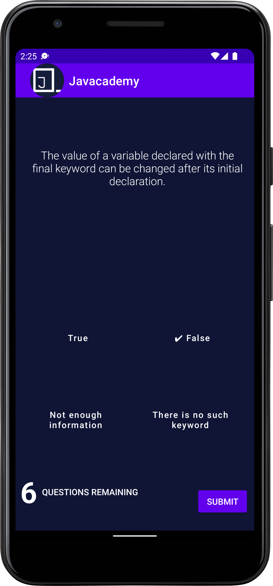
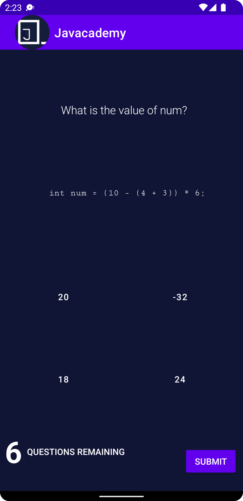
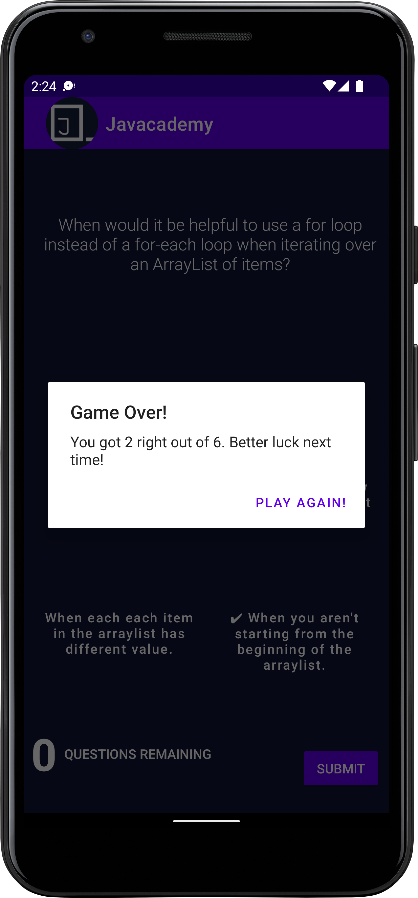

# About
“Javacademy” is an android application that is designed to help learners review and practice what they have learned on the web about Java anywhere, anytime by the help of quizes.

# Features
Javacademy is a mobile app and supplemental tool to the Java learning experience.  
Included:
- Various sets of quizzes based on proficiency
- Restart quizes
- Show quiz score
- Enormous question pool
- Randomized questions
       
# Tools used
- Gradle
- Android Studio IDE
- Android API 32
- Extensible Markup Language (XML)

# Preview:

Start of the quiz             |  In between  |  Start over
:-------------------------:|:-------------------------:  |:-------------------------:
  |    |  

Thanks

Regards ~ Mustafa
